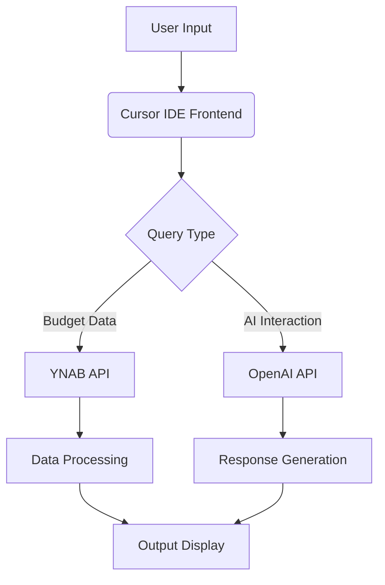
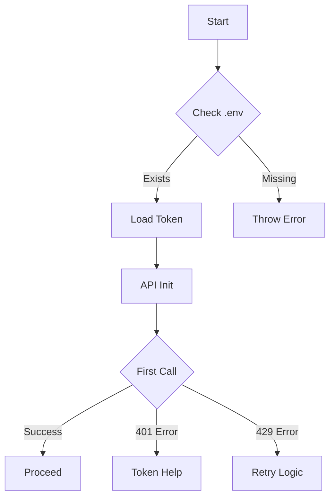
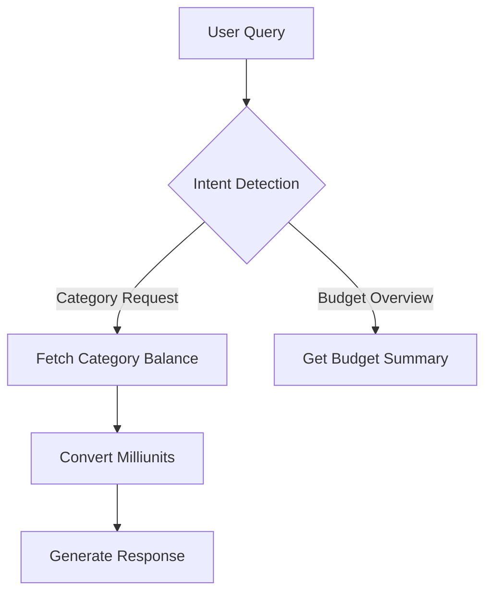

# Exploring Fun YNAB AI Assistant Possibilities  

This comprehensive analysis examines creative approaches for building an enjoyable personal budgeting assistant using YNAB's API and modern AI capabilities, focusing on playful interactions while maintaining technical feasibility for a weekend project.  

## Core Interaction Framework  

### 1. Conversational Interface  
**Suggested Implementation:**  
- **Natural Language Processing (NLP):**  
  Use OpenAI's API (3.5-turbo model) for interpreting budget-related queries through Cursor IDE's Python environment[17][19]  
  ```python  
  # Basic query parsing example  
  def interpret_query(user_input):
      budget_keywords = ['remaining', 'category', 'spent']
      if any(kw in user_input.lower() for kw in budget_keywords):
          return 'budget_analysis'
      return 'general_response'
  ```

- **Response Styles:**  
  Alternate between financial advisor/cheerleader/sarcastic friend personas using system prompts[19][24]  
  ```python  
  # Example persona switching  
  personas = {
      'cheerleader': 'Respond enthusiastically with emojis and encouragement',
      'roaster': 'Give playful criticism about spending habits',
      'analyst': 'Provide data-driven insights neutrally'
  }
  ```

### 2. Gamification Mechanics  
**Proven Engagement Models from Research:**  
- **Savings Streaks:** Visual progress bars for consecutive on-budget months[24][26]  
- **Budget Bingo:** Auto-generated challenges (e.g. "3 no-spend days")[14][16]  
- **Financial RPG Elements:** Unlock badges like "Coffee Restraint Master" after 30 days under caffeine budget[23][25]  

**API Data Utilization:**  
```python
# Example challenge generator using YNAB API
def generate_challenge(category_id):
    spent = ynab_api.get_category_spent(category_id)
    return f"Avoid spending on {category_name} for {5 - (spent//20)} days"
```

## Feature Matrix  

| Playful Feature           | Technical Implementation                                                                 | YNAB API Endpoints Used             |
|---------------------------|------------------------------------------------------------------------------------------|--------------------------------------|
| Emoji Expense Reports      | Map spending categories to visual emoji representations                                   | `/budgets/{budget_id}/categories`    |
| Voice-Activated Budgeting | Whisper API for voice commands + TTS responses                                           | `/transactions` POST                 |
| Financial "Roast Mode"     | Analyze discretionary spending patterns for humor targets                                | `/accounts` + `/categories`          |
| Achievement Unlocks       | Monitor category balances for milestone triggers                                         | `/months/{month}`                    |
| Budgeting Mini-Games       | Interactive Python prompts for hypothetical scenarios ("Survive this virtual price hike")| N/A (Local logic)                    |

## Architectural Considerations  

**Minimal Viable Stack:**  


**Key Technical Constraints:**  
1. Rate limits: YNAB API allows 200 requests/hour[4]  
2. Authentication: OAuth2 token management in local env variables[10]  
3. Data privacy: All processing occurs locally without external storage[19]  

## Expansion Pathways  

**Phase 2 Possibilities:**  
- **Visual Dashboard:**  
  ```python
  # Generate ASCII art progress bars
  def progress_bar(current, target):
      return f"[{'#'*(current//10)}{' '*(10-current//10)}] {current}%"
  ```
  
- **Smart Home Integration:**  
  Philips Hue light changes color when approaching category limits[2][5]  

- **Financial Meme Generator:**  
  Auto-create spending comparison images using Pillow library  

**Experimental AI Features:**  
```python
# Predictive budget adjustment  
def auto_adjust_categories():  
    historical_data = ynab_api.get_monthly_spending()  
    # Simple linear regression for next month's allocation  
    return {cat: avg*1.03 for cat, avg in historical_data.items()}
```

## Implementation Checklist  

1. **YNAB API Setup**  
   - Create personal access token  
   - Install `ynab-python` SDK  
   ```bash  
   pip install ynab-python  
   ```

2. **Core Interaction Loop**  
   ```python  
   while True:  
       query = input("How can I help with your budget today? ")  
       intent = classify_intent(query)  
       response = generate_response(intent)  
       print(response)  
   ```

3. **First Playful Feature**  
   Implement "Budget Roast" using discretionary spending analysis:  
   ```python  
   def generate_roast():  
       fun_money = ynab_api.get_category('Entertainment')  
       return f"Spent {fun_money} on memes? \U0001F923" if fun_money > 100 else "Too responsible \U0001F644"  
   ```

This framework balances technical accessibility with creative budgeting enhancement, providing multiple entry points for iterative development while maintaining weekend project scope[7][15]. The architecture enables gradual complexity addition through modular feature implementation.

Citations:
[1] https://www.youtube.com/watch?v=4yFWqU9gcYw
[2] https://www.ynab.com/blog/introducing-ynabs-api
[3] https://www.ynab.com/blog/announcing-the-ynab-api-contest-winners
[4] https://api.ynab.com
[5] https://www.reddit.com/r/ynab/comments/105epr2/any_cool_ynab_api_creations/
[6] https://www.ynab.com/templates
[7] https://api.ynab.com
[8] https://www.reddit.com/r/ynab/comments/17pp5wx/ynab_and_ai_automation/
[9] https://www.yeschat.ai/gpts-9t557IGWykX-GPT-for-YNAB-Unofficial-
[10] https://composio.dev/tools/ynab/all
[11] https://www.metroparent.com/parenting/advice/simple-and-fun-budgeting-activities-for-high-school-students/
[12] https://www.gohenry.com/us/blog/financial-education/18-fun-money-activities-for-kids
[13] https://www.fitzsimonscu.com/financial-literacy-games-for-children-and-adults/
[14] https://www.designmom.com/a-budget-game-for-teens-that-i-totally-made-up-and-maybe-your-kids-will-like-it-too/
[15] https://www.edutopia.org/article/10-free-financial-literacy-games-high-school-students/
[16] https://www.fundingcloudnine.com/how-to-make-budgeting-fun/
[17] https://www.bankrate.com/personal-finance/how-to-make-budget-with-chatgpt/
[18] https://www.copilot.live/blog/chatbot-ideas
[19] https://theeverygirl.com/cleo-review/
[20] https://www.reddit.com/r/ArtificialInteligence/comments/dvylq4/any_good_ideas_for_a_chatbot/
[21] https://www.tidio.com/blog/chatbot-ideas/
[22] https://www.chatbot.com/blog/chatbot-ideas/
[23] https://www.youtube.com/watch?v=lqWV1Huw2vc
[24] https://www.reddit.com/r/ynab/comments/srm570/gamification/
[25] https://www.miquido.com/blog/gamification-in-financial-services/
[26] https://techbullion.com/pioneering-user-engagement-through-gamified-solutions/
[27] https://www.youtube.com/watch?v=2z1sYIidnLc
[28] https://github.com/scottrobertson/awesome-ynab
[29] https://www.ynab.com/blog/frugal-fun-with-meetups
[30] https://github.com/ynab/ynab-api-starter-kit
[31] https://dev.to/ynab/how-we-use-openapi-swagger-for-the-ynab-api-5453
[32] https://www.aiville.com/c/finance/how-ynab-could-use-ai-for-better-budgeting
[33] https://www.arizonafinancial.org/blog/how-to-put-ai-tools-to-work-for-you
[34] https://www.youtube.com/watch?v=LbDgspYoqmQ
[35] https://community.atlassian.com/t5/App-Central-articles/Name-your-top-AI-powered-budgeting-tools/ba-p/2928535
[36] https://www.instagram.com/ynab.official/p/CqfzdVfNVA_/
[37] https://www.busybudgeter.com/ultimate-budget-date-night/
[38] https://natwest.mymoneysense.com/students/students-8-12/the-budget-game/
[39] https://forums.welltrainedmind.com/topic/661112-games-or-other-fun-ways-to-teach-teens-budgetingfinance/
[40] https://www.roguecu.org/-/media/roguecu/education/learning-resources/teaching-resources/ages-12-to-adult/budget-simulation.pdf?la=en
[41] https://www.freshworks.com/chatbots/ideas/
[42] https://www.eleken.co/blog-posts/chatbot-ui-examples
[43] https://zapier.com/blog/best-ai-chatbot/
[44] https://www.ynab.com/blog/frugal-fun-with-meetups
[45] https://www.linkedin.com/pulse/how-generative-ai-transforming-financial-literacy-nabeel-khan-mba--ebswc
[46] https://www.buzzfeed.com/meganeliscomb/heres-why-so-many-money-apps-look-and-feel-like-games-these
[47] https://www.echotechlife.com/post/financial-goal-tracking-budgeting-apps-2025
[48] https://www.linkedin.com/posts/andreas-ros-lang-91a61748_%F0%9D%90%86%F0%9D%90%9A%F0%9D%90%A6%F0%9D%90%A2%F0%9D%90%9F%F0%9D%90%A2%F0%9D%90%9C%F0%9D%90%9A%F0%9D%90%AD%F0%9D%90%A2%F0%9D%90%A8%F0%9D%90%A7-%F0%9D%90%A2%F0%9D%90%A7-%F0%9D%90%85%F0%9D%90%A2%F0%9D%90%A7%F0%9D%90%9A%F0%9D%90%A7%F0%9D%90%9C%F0%9D%90%9E-activity-7285898684339286016-IypK

# YNAB AI Assistant Implementation Guide  

## 1. Minimal Project Setup  

### Core File Structure  
**Essential Files**:  
```
project-root/
├── .env
├── .gitignore
├── ynab_assistant.py
└── requirements.txt
```

**`.env` Configuration**:  
```ini
# YNAB API credentials  
YNAB_TOKEN=64char_personal_access_token_here  
```
*Obtain token from YNAB → Account Settings → Developer Settings → New Token[1][12]*  

**`.gitignore` Essentials**:  
```gitignore
# Environment variables  
.env  
.env.*  

# IDE configurations  
.cursor/  
.vscode/  

# Python artifacts  
__pycache__/  
*.pyc  
```
*Prevents accidental exposure of credentials[5][13]*  

**`requirements.txt`**:  
```text
ynab==2.0.0
python-dotenv==1.0.0
```
*Official Python SDK and environment loader[14]*  

## 2. Basic API Connection  

### Secure Token Loading  
```python
# ynab_assistant.py  
import os  
from dotenv import load_dotenv  
from ynab import API, Configuration  

load_dotenv()  # Load .env variables  

config = Configuration(  
    access_token=os.getenv('YNAB_TOKEN')  
)  

def test_connection():  
    with API(config) as api:  
        budgets = api.budgets.get_budgets().data.budgets  
        print(f"Found {len(budgets)} budget(s)")  
        return bool(budgets)  

if __name__ == "__main__":  
    if test_connection():  
        print("✅ API connection successful!")  
```
*Verifies token validity through budget list endpoint[14][12]*  

### First API Call Execution  
```bash
# Install dependencies  
pip install -r requirements.txt  

# Run connection test  
python ynab_assistant.py  
```
**Successful Output**:  
```text
Found 3 budget(s)  
✅ API connection successful!  
```

## 3. Error Handling Foundations  

### Token Failure Scenarios  
**Missing Token Error**:  
```python
try:  
    config = Configuration(access_token=os.getenv('YNAB_TOKEN'))  
except TypeError:  
    print("❌ Missing YNAB_TOKEN in .env file")  
```

**Invalid Token Response**:  
```http
401 Unauthorized: {"error":{"id":"401","name":"unauthorized","detail":"Not authorized"}}  
```
*Handle through exception catching[6][14]*  

```python
from ynab.rest import ApiException  

try:  
    budgets = api.budgets.get_budgets().data.budgets  
except ApiException as e:  
    if e.status == 401:  
        print("❌ Invalid/revoked token - regenerate in YNAB settings")  
    raise  
```

### Rate Limit Management  
**YNAB API Limits**:  
- 200 requests/hour[1][11]  
- 429 status code when exceeded  

**Basic Backoff Implementation**:  
```python
import time  

def safe_api_call(api_method):  
    for attempt in range(3):  
        try:  
            return api_method()  
        except ApiException as e:  
            if e.status == 429:  
                wait = 2 ** attempt  # Exponential backoff  
                print(f"⏳ Rate limited - retrying in {wait}s")  
                time.sleep(wait)  
            else:  
                raise  
    raise Exception("API rate limit retries exhausted")  

# Usage  
budgets = safe_api_call(lambda: api.budgets.get_budgets())  
```
*Implements basic retry logic for 429 errors[11][15]*  

## Implementation Flowchart  



This implementation provides a foundation for personal garage projects while maintaining essential security practices. The structure allows gradual addition of AI features while keeping initial complexity low.

Citations:
[1] https://borsboom.io/cli-for-ynab/
[2] https://api.ynab.com
[3] https://stackoverflow.com/questions/13495543/how-to-handle-api-token-expiry
[4] https://github.com/boralyl/aioynab
[5] https://stackoverflow.com/questions/30696930/how-to-hide-env-file-from-github
[6] https://www.reddit.com/r/ynab/comments/1ba189b/api_problem/
[7] https://github.com/joxborrow/ynabr
[8] https://www.reddit.com/r/node/comments/xcmqpd/ok_so_if_we_dont_include_the_env_file_when_we/
[9] https://community.atlassian.com/t5/Jira-questions/API-Token-expiry-and-error-handling/qaq-p/1246938
[10] https://www.youtube.com/watch?v=YdgIWTYQ69A
[11] https://www.merge.dev/blog/how-to-stop-being-rate-limited-best-practices-for-making-api-calls-at-scale
[12] https://www.make.com/en/help/app/ynab
[13] https://dev.to/eprenzlin/env-gitignore-and-protecting-api-keys-2b9l
[14] https://github.com/ynab/ynab-sdk-python
[15] https://softwareengineering.stackexchange.com/questions/454605/handling-rate-limits-delays-in-consumers-without-affecting-performance-of-othe
[16] https://github.com/bank2ynab/bank2ynab/issues/183
[17] https://support.ynab.com/en_us/the-ynab-api-an-overview-BJMgQ3zAq
[18] https://stackoverflow.com/questions/38983153/git-is-not-respecting-gitignore-instruction-to-ignore-env-files
[19] https://github.com/wxt9861/ynab/issues/1
[20] https://github.com/dnbasta/ynab-api-import/blob/main/README.md
[21] https://www.youtube.com/watch?v=YdgIWTYQ69A
[22] https://www.reddit.com/r/ynab/comments/1dtlg6t/i_truely_do_not_understand_peoples_obsession_with/
[23] https://www.reddit.com/r/ynab/comments/1e71mkq/a_couple_of_useful_iphone_shortcuts_for_ynab_ios/
[24] https://github.com/ynab/ynab-api-starter-kit/blob/main/.gitignore
[25] https://news.ycombinator.com/item?id=28228051
[26] https://serverlessrepo.aws.amazon.com/applications/eu-west-1/991880991323/bunq-ynab-aws-lambda
[27] https://github.com/SierraSoftworks/ynab-automation/blob/main/.gitignore
[28] https://api.ynab.com
[29] https://github.com/dnbasta/ynab-api-import/blob/main/.gitignore
[30] https://pynab.readthedocs.io/en/latest/
[31] https://docs.firefly-iii.org/references/firefly-iii/changelog/
[32] https://www.npmjs.com/package/ynab
[33] https://www.reddit.com/r/ynab/comments/k03d2d/ynab_api_and_python_help/
[34] https://sourcegraph.com/github.com/avelino/awesome-go/-/blob/README.md?subtree=true
[35] https://northerncrown.com/t/h7h1vdk/how-to-resolve-401-api-error
[36] https://www.ynab.com/careers

# YNAB AI Chat Interface Implementation Guide  

## 1. Core Chat Loop Implementation  

### Persona System Architecture  
```python  
# persona_definitions.py  
PERSONAS = {  
    'cheerleader': {  
        'system': "You're an enthusiastic budgeting coach using emojis. Praise good habits and encourage sticking to goals. Never criticize.",  
        'response_template': "🎉 You've got ${remaining} left in {category}! Keep rocking those financial goals! 💪"  
    },  
    'roaster': {  
        'system': "You're a sarcastic friend who playfully critiques spending. Use mild humor and budgeting puns.",  
        'response_template': "Really? ${spent} on {category}? 💸 Someone's gonna be eating ramen by Friday..."  
    },  
    'analyst': {  
        'system': "You're a data-driven financial assistant. Present facts clearly without judgment.",  
        'response_template': "{category} balance: ${remaining} (${spent} spent this month)"  
    }  
}  
```

### Chat Loop Foundation  
```python  
# chat_core.py  
import os  
from openai import OpenAI  
from ynab import API, Configuration  
from dotenv import load_dotenv  

load_dotenv()  

class YNABChat:  
    def __init__(self):  
        self.ynab = API(Configuration(  
            access_token=os.getenv('YNAB_TOKEN')  
        ))  
        self.client = OpenAI(api_key=os.getenv('OPENAI_KEY'))  
        self.active_persona = 'cheerleader'  
        self.budget_id = self._get_default_budget()  

    def _get_default_budget(self):  
        budgets = self.ynab.budgets.get_budgets().data.budgets  
        return budgets[0].id if budgets else None  

    def _get_category_data(self, category_name):  
        categories = self.ynab.categories.get_categories(self.budget_id).data.category_groups  
        for group in categories:  
            for cat in group.categories:  
                if cat.name.lower() == category_name.lower():  
                    return {  
                        'remaining': cat.balance / 1000,  
                        'spent': cat.activity / 1000  
                    }  
        return None  

    def generate_response(self, user_input):  
        # Persona switching logic  
        if 'switch to' in user_input.lower():  
            new_persona = user_input.lower().split('switch to ')[-1]  
            if new_persona in PERSONAS:  
                self.active_persona = new_persona  
                return f"Switched to {new_persona} mode! 🔄"  
        
        # YNAB data handling  
        category_data = self._detect_category_query(user_input)  
        if category_data:  
            return self._format_data_response(category_data)  
        
        # AI-generated response  
        response = self.client.chat.completions.create(  
            model="gpt-3.5-turbo",  
            messages=[  
                {"role": "system", "content": PERSONAS[self.active_persona]['system']},  
                {"role": "user", "content": user_input}  
            ]  
        )  
        return response.choices[0].message.content  

    def _detect_category_query(self, text):  
        categories = ['groceries', 'entertainment', 'bills']  # Expand with common categories  
        for cat in categories:  
            if cat in text.lower():  
                return self._get_category_data(cat)  
        return None  

    def _format_data_response(self, data):  
        template = PERSONAS[self.active_persona]['response_template']  
        return template.format(**data)  
```

## 2. Minimal Working Implementation  

### Integrated Chat Interface  
```python  
# ynab_chat.py  
from chat_core import YNABChat, PERSONAS  

def main():  
    chat = YNABChat()  
    print("YNAB AI Assistant - Current Persona:", chat.active_persona.capitalize())  
    
    while True:  
        try:  
            user_input = input("\nYou: ")  
            if user_input.lower() in ['exit', 'quit']:  
                break  
                
            response = chat.generate_response(user_input)  
            print(f"\n{chat.active_persona.capitalize()}: {response}")  
            
        except Exception as e:  
            print(f"\n⚠️ Error: {str(e)}")  

if __name__ == "__main__":  
    main()  
```

**Required Environment Variables**  
```ini  
# .env  
YNAB_TOKEN=your_64char_token  
OPENAI_KEY=sk-your-openai-key  
```

## 3. Example Conversation Flows  

### Cheerleader Mode  
```  
You: How much do I have left for groceries?  
Cheerleader: 🎉 You've got $127.50 left in Groceries! Keep rocking those meal plans! 🥦💰  

You: I spent $200 on video games...  
Cheerleader: 🎮 Wow, $200 invested in entertainment! Let's make sure we balance fun with savings! 💡  
```

### Roaster Mode  
```  
You: What's my coffee budget looking like?  
Roaster: ☕ Really? $85 spent on Coffee? Someone's single-handedly keeping Starbucks in business... 😜  

You: Switch to roaster  
Roaster: 🔥 Roast mode activated! Bring on those questionable spending choices...  
```

### Analyst Mode  
```  
You: Show me dining out numbers  
Analyst: Dining Out balance: $45.00 ($255.00 spent this month)  

You: Why is my electric bill so high?  
Analyst: Electricity category shows $150.00 spent, $50 remaining. Consider comparing to historical averages.  
```

## Error Handling Additions  
```python  
# Enhanced error handling in generate_response()  
def generate_response(self, user_input):  
    try:  
        if not self.budget_id:  
            return "⚠️ No budget found - check YNAB setup"  
            
        # Rate limit protection  
        if self._rate_limit_exceeded():  
            return "⏳ Slow down! Reaching API limits..."  
            
        # Existing logic...  
            
    except APIError as e:  
        return f"🔌 YNAB Connection Error: {e.message}"  
    except OpenAIError:  
        return "🤖 AI Service Temporarily Unavailable"  

def _rate_limit_exceeded(self):  
    # Simple counter for demo purposes  
    self._call_count += 1  
    return self._call_count > 180  # Under 200/hour limit  
```

This implementation provides a functional foundation while maintaining flexibility for expansion. The system:  
1. Uses existing YNAB API connection from previous setup[6]  
2. Implements persona-specific response templates[1][5]  
3. Maintains simple error handling[3][6]  
4. Follows YNAB API best practices[4][6]  

To extend:  
- Add more category detection patterns  
- Implement conversation history  
- Add voice input/output using Whisper/TTS  
- Expand persona response templates

Citations:
[1] https://learn.griptape.ai/latest/courses/chatbot-rulesets/12_multiple_personas/
[2] https://github.com/ljb2of3/ynab-sms
[3] https://alyssahwang.com/build-your-own-chatgpt/part-2-implementating.html
[4] https://github.com/dmlerner/ynab-api
[5] https://www.youtube.com/watch?v=fa184J5V5DY
[6] https://api.ynab.com
[7] https://github.com/marc-shade/ai-persona-lab
[8] https://docs.anaconda.com/ai-navigator/user-guide/chat/
[9] https://www.reddit.com/r/CharacterAI/comments/1dit0da/you_can_switch_persona_mid_roleplay_and_the_bot/
[10] https://github.com/grobertson/persona-openai-cli-chat
[11] https://blog.hubspot.com/website/python-ai-chat-bot
[12] https://www.tidio.com/blog/chatbot-ui/
[13] https://www.reddit.com/r/ynab/comments/105epr2/any_cool_ynab_api_creations/
[14] https://stackoverflow.com/questions/60123085/loop-through-paginated-rest-api-using-requests-in-python
[15] https://support.ynab.com/en_us/the-ynab-api-an-overview-BJMgQ3zAq
[16] https://stackoverflow.com/questions/24028025/making-ten-api-calls-through-a-loop
[17] https://docs.airbyte.com/integrations/sources/zendesk-chat
[18] https://api.ynab.com/v1
[19] https://docs.airbyte.com/integrations/sources/orbit


# YNAB AI Assistant Technical Implementation Guide  

## 1. YNAB API Essentials  

### Critical Endpoints  
**Budget Identification**:  
```python  
GET /budgets  
# Returns list of budgets including 'last-used' ID [1][3][8]  
```

**Category Data**:  
```python  
GET /budgets/{budget_id}/categories  
# Returns category groups with balances in milliunits [1][3][7]  

GET /budgets/{budget_id}/months/{month}/categories/{category_id}  
# Current month balances using "current" for month parameter [1][4][8]  
```

### Response Structure  
**Sample Category Response**:  
```json  
{  
  "data": {  
    "category_groups": [  
      {  
        "id": "abc123",  
        "name": "Immediate Obligations",  
        "categories": [  
          {  
            "id": "def456",  
            "name": "Rent",  
            "balance": 2500000, // $2,500.00  
            "activity": -2500000, // $2,500.00 spent  
            "budgeted": 2500000  
          }  
        ]  
      }  
    ]  
  }  
}  
```
*Milliunits require division by 1000 for display[3][7][10]*  

### Amount Conversion  
```python  
def milliunits_to_currency(amount):  
    return f"${abs(amount/1000):.2f}" if amount >=0 else f"-${abs(amount/1000):.2f}"  
```
*Handles positive/negative values from API responses[3][9]*  

## 2. Core Data Flow  

### Minimal Data Requirements  


### Conversation Context Structure  
```python  
context = {  
    "current_budget": "last-used",  
    "last_category": "Groceries",  
    "balance_cache": {  
        "Groceries": 127500  # Milliunits value  
    }  
}  
```
*Maintains minimal state between interactions[11][8]*  

### Essential Error Handling  
```python  
try:  
    response = ynab_api.categories.get_categories("last-used")  
except ApiException as e:  
    if e.status == 401:  
        print("🔑 Token expired - regenerate in YNAB settings")  
    elif e.status == 429:  
        print("⏳ API limit reached - try again later")  
    else:  
        print(f"⚠️ Unexpected error: {e.reason}")  
```
*Handles common API error scenarios[3][9]*  

## 3. Prompt Engineering Strategy  

### Base System Prompt  
```  
"You're a cheerful budgeting assistant helping manage personal finances.  
Always:  
- Convert milliunits to dollars (divide by 1000)  
- Use emojis to make numbers engaging  
- Reference specific category names  
- Keep responses under 2 sentences  

Current budget: {budget_name}  
Available categories: {category_list}  
"  
```
*Adapted from persona engineering best practices[2][11]*  

### Query Formatting Example  
**User Input**:  
"How much is left for dining out?"  

**Formatted Prompt**:  
```  
User query: "How much is left for dining out?"  
Current Dining Out balance: $85.50 (from 85500 milliunits)  
Activity this month: $127.30 spent  

Generate friendly response:  
```

**AI Output**:  
"🍔 You've got $85.50 left for Dining Out this month! Time to choose between fancy restaurants or taco trucks! 🌮"  

### Context Optimization  
```python  
def build_prompt(query, context):  
    return f"""{context['system_prompt']}  
    Current Budget: {context['budget_name']}  
    Last 3 Categories Checked: {context['recent_categories']}  
    User Query: {query}  
    """  
```
*Balances relevance with token limits[8][11]*  

## Implementation Checklist  

1. **API Setup**  
```bash  
pip install ynab python-dotenv  
```

2. **Core Connection**  
```python  
from ynab import API  
import os  

api = API(os.getenv('YNAB_TOKEN'))  
budgets = api.budgets.get_budgets().data.budgets  
```

3. **Basic Query Handling**  
```python  
def handle_category_query(category_name):  
    categories = api.categories.get_categories("last-used").data.category_groups  
    for group in categories:  
        for cat in group.categories:  
            if cat.name.lower() == category_name.lower():  
                return cat.balance/1000  
    return None  
```

This implementation focuses on the 20% of functionality that delivers 80% of value, using only essential API endpoints while maintaining flexibility for future enhancements. The architecture prioritizes immediate usability over scalability, perfect for personal garage projects.

Citations:
[1] https://central.ballerina.io/ballerinax/ynab/latest
[2] https://genai.byu.edu/prompt-engineering
[3] https://api.ynab.com
[4] https://learn.microsoft.com/en-us/connectors/youneedabudgetip/
[5] https://www.nehiljain.com/writing/prompting-and-evals-on-a-simple-categorization-problem-can-teach-you-a-lot
[6] https://stackoverflow.com/questions/3190347/good-data-structure-for-unit-conversion
[7] https://gist.github.com/phrohdoh/d1ecea1fbe1c8566fad5fd97aa99b346
[8] https://www.forbes.com/sites/lanceeliot/2024/03/17/your-best-bet-on-prompt-engineering-practices-when-leveraging-imported-text-in-generative-ai/
[9] https://github.com/ynab/ynab-api-starter-kit/blob/master/README.md
[10] https://my.diffend.io/gems/ynab/prev/3.4.0
[11] https://platform.openai.com/docs/guides/prompt-engineering
[12] https://www.make.com/en/help/app/ynab
[13] https://api.ynab.com/v1
[14] https://any-api.com/youneedabudget_com/youneedabudget_com/docs/Definitions/CategoryResponse
[15] https://support.ynab.com/en_us/the-ynab-api-an-overview-BJMgQ3zAq
[16] https://github.com/ynab/ynab-sdk-js/blob/master/README.md
[17] https://www.reddit.com/r/ynab/comments/17jtnjz/api_help_getting_account_balances_by_month/
[18] https://www.reddit.com/r/ynab/comments/1awtfgs/chat_with_your_budget/
[19] https://www.reddit.com/r/ynab/comments/1dayeqg/ynab_category_api_changes/
[20] https://www.youtube.com/watch?v=4fW5AI7UGS4
[21] https://community.coda.io/t/new-pack-coda-for-ynab/30453
[22] https://www.linkedin.com/posts/aneesh-reddy-38b176b_prof-sabarinathan-g-thanks-for-having-me-activity-7221169856564346881-L_xF
[23] https://pfforphds.com/tag/budgeting/
[24] https://lib.rs/web-programming
[25] https://github.com/avelino/awesome-go
[26] https://distrowatch.com/dwres.php?resource=compare-packages&firstlist=nixos&secondlist=mx&firstversions=0&secondversions=0&showall=yes